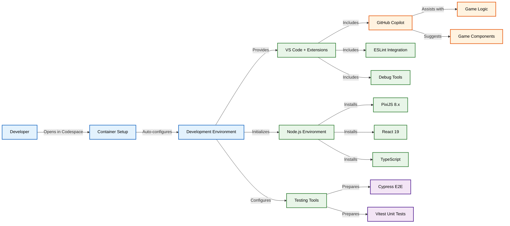

# Game Template

A clean, minimal template for building games with React, TypeScript, PixiJS, and Vite - built with **security-first principles**.

## Badges

[](https://github.com/Hack23/game/raw/master/LICENSE.md)
[](https://scorecard.dev/viewer/?uri=github.com/Hack23/game)

## 🔒 Security Features

This template implements comprehensive security measures:

- **🛡️ Supply Chain Security** - OSSF Scorecard analysis and dependency review
- **🔍 Static Analysis** - CodeQL scanning for vulnerabilities
- **📦 Dependency Protection** - Automated dependency vulnerability checks
- **� License Compliance** - Automated checking of dependency licenses (MIT, Apache-2.0, BSD variants, ISC, CC0-1.0, Unlicense)
- **📋 SBOM Quality Validation** - Automated SBOM quality scoring with minimum 7.0/10 threshold using SBOMQS
- **�🔐 Runner Hardening** - All CI/CD runners are hardened with audit logging
- **📋 Security Policies** - GitHub security advisories and vulnerability reporting
- **🏷️ Pinned Dependencies** - All GitHub Actions pinned to specific SHA hashes
- **📄 SBOM Generation** - Software Bill of Materials for transparency
- **🔏 Build Attestations** - Cryptographic proof of build integrity
- **🛡️ Immutable Releases** - Artifacts cannot be tampered with
- **🔐 Build Integrity** - Original builds remain unchanged
- **📋 Audit Trail** - Complete release history
- **🏆 Artifact Verification** - SLSA-compliant build provenance
- **🕷️ ZAP Security Scanning** - OWASP ZAP dynamic application security testing
- **⚡ Lighthouse Performance** - Automated performance and accessibility audits

## Features

- ⚡ **Vite** - Fast build tool and dev server
- ⚛️ **React 19** - Modern React with hooks
- 🔷 **TypeScript** - Strict typing with latest standards
- 🧪 **Vitest** - Fast unit testing with coverage
- 🌲 **Cypress** - Reliable E2E testing
- 📦 **ESLint** - Code linting with TypeScript rules
- 🔄 **GitHub Actions** - Automated testing and reporting
- 🎮 **PixiJS 8.x** - High-performance WebGL renderer for 2D games
- 🎵 **Howler.js** - Audio library for games

## 🚀 Using This Template

When you create a new repository from this template, follow these essential setup steps to get all security and automation features working properly:

### 1. 📋 Setup Repository Labels

Labels are essential for automated pull request categorization and release note generation.

**Run the setup workflow:**

1. Go to **Actions** → **Setup Repository Labels**
2. Click **"Run workflow"**
3. Choose whether to recreate all labels (optional)
4. Wait for completion

This creates all necessary labels for:

- 🚀 Features and enhancements
- 🐛 Bug fixes
- 🎮 Game development (graphics, audio, game logic)
- 🔒 Security and compliance
- 📦 Dependencies and infrastructure

### 2. 🌐 Enable GitHub Pages Deployment

Enable GitHub Pages to automatically deploy your game when creating releases.

**Setup GitHub Pages:**

1. Go to **Settings** → **Pages**
2. Under **Source**, select **"GitHub Actions"**
3. Save the configuration

Your game will be automatically deployed to `https://your-username.github.io/your-repo-name/` when you run the release workflow.

### 3. 🔒 Update Security Badge

Update the OpenSSF Scorecard badge to point to your repository.

**Edit the README:**

```markdown
[![OpenSSF Scorecard] https://api.securityscorecards.dev/projects/github.com/theamazingarce/game23/badge ]

Replace `your-username/your-repo-name` with your actual GitHub repository path.

### 4. 🎮 Start Building Your Game

With the template configured, you can now:

1. **Develop locally or in Codespaces**

   ```bash
   npm install
   npm run dev
   ```

2. **Create pull requests** - Labels will be automatically applied
3. **Run tests** - Automated testing on every push/PR
4. **Create releases** - Use the release workflow for deployment
5. **Monitor security** - Automated security scanning and scoring

### 🔄 Available Workflows

Your repository includes these automated workflows:

| Workflow                      | Trigger          | Purpose                                                                                         |
| ----------------------------- | ---------------- | ----------------------------------------------------------------------------------------------- |
| **Setup Repository Labels**   | Manual           | Creates all required labels for PR categorization                                               |
| **Test and Report**           | Push/PR          | Runs unit tests, E2E tests, license compliance, SBOM quality validation, and generates coverage |
| **Build, Attest and Release** | Manual/Tag       | Creates secure releases with SBOM, license validation, and attestations                         |
| **CodeQL Analysis**           | Push/PR/Schedule | Static code analysis for security vulnerabilities                                               |
| **Dependency Review**         | PR               | Reviews dependencies for known vulnerabilities                                                  |
| **Scorecard Analysis**        | Push/Schedule    | OSSF supply chain security assessment                                                           |
| **ZAP Security Scan**         | Manual           | Dynamic security testing of deployed app                                                        |
| **Lighthouse Performance**    | Manual           | Performance and accessibility audits                                                            |

### 🛡️ Security Features Ready to Use

Once configured, your repository automatically provides:

- **🛡️ Supply Chain Security** - OSSF Scorecard analysis and dependency review
- **🔍 Static Analysis** - CodeQL scanning for vulnerabilities
- **📦 Dependency Protection** - Automated dependency vulnerability checks
- **� License Compliance** - Automated checking of dependency licenses (MIT, Apache-2.0, BSD variants, ISC, CC0-1.0, Unlicense)
- **📋 SBOM Quality Validation** - Automated SBOM quality scoring with minimum 7.0/10 threshold using SBOMQS
- **�🔐 Runner Hardening** - All CI/CD runners are hardened with audit logging
- **📋 Security Policies** - GitHub security advisories and vulnerability reporting
- **🏷️ Pinned Dependencies** - All GitHub Actions pinned to specific SHA hashes
- **📄 SBOM Generation** - Software Bill of Materials for transparency
- **🔏 Build Attestations** - Cryptographic proof of build integrity
- **🛡️ Immutable Releases** - Artifacts cannot be tampered with
- **🔐 Build Integrity** - Original builds remain unchanged
- **📋 Audit Trail** - Complete release history
- **🏆 Artifact Verification** - SLSA-compliant build provenance
- **🕷️ ZAP Security Scanning** - OWASP ZAP dynamic application security testing
- **⚡ Lighthouse Performance** - Automated performance and accessibility audits

### 🎯 Next Steps

1. **Replace the example game** in `src/components/` with your game logic
2. **Add game assets** to the `public/assets/` directory
3. **Create your first PR** to see automated labeling in action
4. **Run your first release** to deploy to GitHub Pages
5. **Monitor security** through the automatically generated security reports

All security workflows will protect your game from vulnerabilities while providing complete transparency through attestations and SBOM generation.

## Development Environment

This template includes a fully configured development environment:

- **🚀 GitHub Codespaces** - Zero-configuration development environment
- **🤖 GitHub Copilot** - AI-assisted development with code suggestions
- **💬 Copilot Chat** - In-editor AI assistance for debugging and explanations
- **🔧 VS Code Extensions** - Pre-configured extensions for game development
- **🔒 Secure Container** - Hardened development container with security features

### 🚀 Codespaces Setup

This repository is fully configured for GitHub Codespaces, providing:

- **One-click setup** - Start coding immediately with zero configuration
- **Pre-installed dependencies** - All tools and libraries ready to use
- **Configured test environment** - Cypress and Vitest ready to run
- **GitHub Copilot integration** - AI-powered code assistance
- **Optimized performance** - Container configured for game development



## Security Workflows

```mermaid
graph TD
    A[🔒 Code Push/PR] --> B{🛡️ Security Gates}

    B --> |🔍 Code Analysis| C[CodeQL Scanning]
    B --> |📦 Dependencies| D[Dependency Review]
    B --> |📜 License Check| E[License Compliance]
    B --> |🏗️ Supply Chain| F[OSSF Scorecard]

    C --> |🚨 Vulnerabilities| G[Security Alerts]
    D --> |⚠️ Known CVEs| G
    E --> |� Invalid Licenses| G
    F --> |�📊 Security Score| H[Security Dashboard]

    G --> I[🚫 Block Merge]
    H --> J[✅ Security Badge]

    subgraph "🔐 Protection Layers"
        K[Runner Hardening]
        L[Pinned Actions]
        M[Audit Logging]
    end

    subgraph "🧪 Runtime Security Testing"
        N[🕷️ ZAP DAST Scan]
        O[⚡ Lighthouse Audit]
        P[🌐 Live Site Testing]
    end

    J --> N
    N --> |🔍 Dynamic Scan| O
    O --> |📊 Performance Report| P

    %% Styling
    classDef security fill:#ffebee,stroke:#c62828,stroke-width:2px,color:#000
    classDef analysis fill:#e8f5e8,stroke:#2e7d32,stroke-width:2px,color:#000
    classDef protection fill:#e3f2fd,stroke:#1565c0,stroke-width:2px,color:#000
    classDef alert fill:#fff3e0,stroke:#ef6c00,stroke-width:2px,color:#000
    classDef runtime fill:#f3e5f5,stroke:#7b1fa2,stroke-width:2px,color:#000

    class A,B,I security
    class C,D,E,F analysis
    class K,L,M protection
    class G,H,J alert
    class N,O,P runtime
```



## Test & Report Workflow

```mermaid
graph TD
    A[🚀 Code Push/PR] --> B{🔍 Prepare Environment}

    B --> |✅ Dependencies| C[🏗️ Build Validation]
    B --> |✅ Cypress Cache| D[🧪 Unit Tests]
    B --> |✅ Display Setup| E[🌐 E2E Tests]

    C --> |✅ Build Success| F{📊 Parallel Testing}

    F --> D
    F --> E

    D --> |📈 Coverage Report| G[📋 Test Reports]
    E --> |🎬 Videos & Screenshots| G

    G --> H[📤 Artifact Upload]
    H --> I[✨ Combined Reports]

    %% Styling
    classDef startEnd fill:#e1f5fe,stroke:#01579b,stroke-width:2px,color:#000
    classDef process fill:#f3e5f5,stroke:#4a148c,stroke-width:2px,color:#000
    classDef test fill:#e8f5e8,stroke:#1b5e20,stroke-width:2px,color:#000
    classDef report fill:#fff3e0,stroke:#e65100,stroke-width:2px,color:#000
    classDef artifact fill:#fce4ec,stroke:#880e4f,stroke-width:2px,color:#000

    class A,I startEnd
    class B,C,F process
    class D,E test
    class G,H report
    class H artifact
```



## Quick Start

```bash
# Using GitHub Codespaces
# Click "Code" button on repository and select "Open with Codespaces"

# Or local development:
# Install dependencies
npm install

# Start development server
npm run dev

# Build for production
npm run build

# Run unit tests
npm run test

# Run E2E tests
npm run test:e2e

# Check license compliance
npm run test:licenses
```

## PixiJS 8.x Integration

This template uses PixiJS 8.x for high-performance 2D game rendering:

- Modern WebGL-based rendering
- Optimized sprite batching
- Integrated with React via @pixi/react
- Sound support via @pixi/sound and Howler.js
- Responsive game canvas
- Touch and mouse input handling

Example game component:

```tsx
import { Stage, Sprite, useTick } from "@pixi/react";
import { useState } from "react";

export function Game() {
  const [position, setPosition] = useState({ x: 100, y: 100 });

  useTick((delta) => {
    // Game logic here
    setPosition((prev) => ({
      x: prev.x + delta,
      y: prev.y,
    }));
  });

  return (
    <Stage width={800} height={600} options={{ backgroundColor: 0x1d2230 }}>
      <Sprite
        image="/assets/character.png"
        x={position.x}
        y={position.y}
        anchor={{ x: 0.5, y: 0.5 }}
      />
    </Stage>
  );
}
```

## Testing

### Unit Tests

- Uses Vitest with jsdom environment
- Configured for React Testing Library
- Coverage reports generated automatically
- Run with: `npm run test`

### E2E Tests

- Uses Cypress for end-to-end testing
- Starts dev server automatically
- Screenshots and videos on failure
- Run with: `npm run test:e2e`

### License Compliance

- Automated checking of dependency licenses using `license-compliance`
- Only allows approved open-source licenses (MIT, Apache-2.0, BSD variants, ISC, CC0-1.0, Unlicense)
- Prevents dependencies with restrictive or unknown licenses
- Run with: `npm run test:licenses`

### SBOM Quality Validation

- Automated SBOM quality assessment using [SBOMQS](https://github.com/interlynk-io/sbomqs) during CI/CD builds
- Validates SBOM completeness across multiple standards (NTIA-minimum-elements, BSI v1.1/v2.0, Semantic, Quality, Sharing, Structural)
- Enforces minimum quality score of **7.0/10** to ensure high-quality Software Bill of Materials
- Checks for essential components: names, versions, unique IDs, suppliers, licenses, checksums, and dependency relationships
- Blocks builds with insufficient SBOM quality to maintain supply chain transparency
- Provides detailed quality reports with actionable feedback for improvement

### CI/CD Pipeline

```mermaid
flowchart LR
    subgraph "🔧 CI Pipeline"
        A1[📝 Code Changes] --> A2[🔍 Lint & Type Check]
        A2 --> A3[🏗️ Build]
        A3 --> A4[🧪 Test]
        A4 --> A5[📊 Report]
    end

    subgraph "🔒 Security Pipeline"
        S1[🛡️ CodeQL Analysis]
        S2[📦 Dependency Review]
        S3[🏆 OSSF Scorecard]
        S4[� SBOM Quality Check]
        S5[�🔐 Runner Hardening]
    end

    subgraph "📈 Test Coverage"
        B1[Unit Tests<br/>80%+ Coverage]
        B2[E2E Tests<br/>Critical Flows]
        B3[Type Safety<br/>Strict Mode]
    end

    subgraph "🎯 Outputs"
        C1[📄 Coverage Reports]
        C2[🎬 Test Videos]
        C3[📸 Screenshots]
        C4[📋 JUnit XML]
        C5[🛡️ Security Reports]
    end

    A4 --> B1
    A4 --> B2
    A4 --> B3

    A1 --> S1
    A1 --> S2
    A1 --> S3
    A1 --> S4
    A1 --> S5

    A5 --> C1
    A5 --> C2
    A5 --> C3
    A5 --> C4
    S1 --> C5
    S2 --> C5
    S3 --> C5
    S4 --> C5

    %% Styling
    classDef pipeline fill:#e3f2fd,stroke:#1565c0,stroke-width:2px
    classDef security fill:#ffebee,stroke:#c62828,stroke-width:2px
    classDef testing fill:#e8f5e8,stroke:#2e7d32,stroke-width:2px
    classDef output fill:#fff8e1,stroke:#f57c00,stroke-width:2px

    class A1,A2,A3,A4,A5 pipeline
    class S1,S2,S3,S4 security
    class B1,B2,B3 testing
    class C1,C2,C3,C4,C5 output
```



### Security Workflows

- **CodeQL Analysis**: Automated vulnerability scanning on push/PR
- **Dependency Review**: Checks for known vulnerabilities in dependencies
- **License Compliance**: Validates all dependencies use approved open-source licenses
- **SBOM Quality Validation**: Automated SBOM quality assessment using SBOMQS with minimum 7.0/10 score requirement
- **OSSF Scorecard**: Supply chain security assessment with public scoring
- **Runner Hardening**: All CI/CD runners use hardened security policies

## 🚀 Release Management

This template includes a comprehensive, security-first release workflow with automated versioning, security attestations, and deployment.

### Release Flow

```mermaid
flowchart TD
    A[🚀 Release Trigger] --> B{📋 Release Type}

    B -->|🏷️ Tag Push| C[🔄 Automatic Release]
    B -->|⚡ Manual Dispatch| D[📝 Manual Release]

    C --> E[📦 Prepare Phase]
    D --> E

    E --> F[🏗️ Build & Test]
    F --> G[🔒 Security Validation]

    G --> H[📄 Generate SBOM]
    H --> I[🔏 Create Attestations]
    I --> J[📋 Draft Release Notes]

    J --> K[🌐 Deploy to Pages]
    K --> L[📢 Publish Release]

    subgraph "🔒 Security Layers"
        M[SLSA Build Provenance]
        N[SBOM Attestation]
        O[Artifact Signing]
        P[Supply Chain Verification]
    end

    I --> M
    I --> N
    I --> O
    G --> P

    %% Styling
    classDef trigger fill:#e1f5fe,stroke:#01579b,stroke-width:2px
    classDef process fill:#f3e5f5,stroke:#4a148c,stroke-width:2px
    classDef security fill:#ffebee,stroke:#c62828,stroke-width:2px
    classDef deploy fill:#e8f5e8,stroke:#1b5e20,stroke-width:2px

    class A,B,C,D trigger
    class E,F,J,K,L process
    class G,H,I,M,N,O,P security
```



### 🏷️ Release Types

#### Automatic Releases (Tag-based)

```bash
# Create and push a tag to trigger automatic release
git tag v1.0.0
git push origin v1.0.0
```

#### Manual Releases (Workflow Dispatch)

- Navigate to **Actions** → **Build, Attest and Release**
- Click **Run workflow**
- Specify version (e.g., `v1.0.1`) and pre-release status
- The workflow handles version bumping and tagging automatically

### 📋 Automated Release Notes

Release notes are automatically generated using semantic labeling:

```mermaid
graph LR
    A[🔄 PR Labels] --> B[📝 Release Drafter]
    B --> C[📊 Categorized Notes]

    subgraph "🏷️ Label Categories"
        D[🚀 New Features]
        E[🎮 Game Development]
        F[🔒 Security & Compliance]
        G[🐛 Bug Fixes]
        H[📦 Dependencies]
        I[🧪 Test Coverage]
    end

    A --> D
    A --> E
    A --> F
    A --> G
    A --> H
    A --> I

    C --> J[📢 GitHub Release]

    classDef labels fill:#fff3e0,stroke:#e65100,stroke-width:2px
    classDef process fill:#e3f2fd,stroke:#1565c0,stroke-width:2px
    classDef output fill:#e8f5e8,stroke:#2e7d32,stroke-width:2px

    class D,E,F,G,H,I labels
    class A,B,C process
    class J output
```



#### Release Note Categories

- **🚀 New Features** - Major feature additions
- **🎮 Game Development** - Game logic, graphics, audio improvements
- **🎨 UI/UX Improvements** - Interface and design updates
- **🏗️ Infrastructure & Performance** - Build and performance optimizations
- **🔄 Code Quality & Refactoring** - Code improvements and testing
- **🔒 Security & Compliance** - Security updates and fixes
- **📝 Documentation** - Documentation improvements
- **📦 Dependencies** - Dependency updates
- **🐛 Bug Fixes** - Bug fixes and patches

### 🔒 Security Attestations & SBOM

#### Software Bill of Materials (SBOM)

Every release includes a comprehensive SBOM in SPDX format:

```json
{
  "SPDXID": "SPDXRef-DOCUMENT",
  "name": "game-v1.0.0",
  "packages": [
    {
      "SPDXID": "SPDXRef-Package-react",
      "name": "react",
      "versionInfo": "19.1.0",
      "licenseConcluded": "MIT"
    }
  ]
}
```

#### Build Provenance Attestations

SLSA-compliant build attestations provide cryptographic proof:

```json
{
  "_type": "https://in-toto.io/Statement/v0.1",
  "predicateType": "https://slsa.dev/provenance/v0.2",
  "subject": [
    {
      "name": "game-v1.0.0.zip",
      "digest": {
        "sha256": "abc123..."
      }
    }
  ],
  "predicate": {
    "builder": {
      "id": "https://github.com/actions/runner"
    },
    "buildType": "https://github.com/actions/workflow@v1"
  }
}
```

#### Verification Commands

```bash
# Verify build provenance
gh attestation verify game-v1.0.0.zip \
  --owner Hack23 --repo game

# Verify SBOM attestation
gh attestation verify game-v1.0.0.zip \
  --owner Hack23 --repo game \
  --predicate-type https://spdx.dev/Document
```

# 🔒 Immutable Releases

This repository uses **GitHub's immutable releases** to prevent unauthorized modifications to published releases.

## What are Immutable Releases?

Immutable releases lock release artifacts after publication, ensuring:

- **🛡️ Supply Chain Security** - Artifacts cannot be tampered with
- **🔐 Build Integrity** - Original builds remain unchanged
- **📋 Audit Trail** - Complete release history

> Only release title and notes can be modified after publication.

## How to Enable

### For Your Repository:

1. Go to **Settings** → **General**
2. Scroll to the **"Releases"** section
3. Check **"Enable release immutability"**
4. ⚠️ Only applies to **future releases**

### For Your Organization:

1. Go to **Organization Settings** → **Repository** → **General**
2. In **"Releases"** section, select policy:
   - **All repositories** - Apply to all org repos
   - **Selected repositories** - Choose specific repos
3. ⚠️ Only applies to **future releases**

## Verification

```bash
# Verify release artifacts haven't been tampered with
gh attestation verify game-v1.1.4.zip --owner Hack23 --repo game
```

---

_Part of our security-first approach alongside OSSF Scorecard, SLSA attestations, and automated scanning._

### 📦 Release Artifacts

Each release includes multiple artifacts with full traceability:

```
📦 Release v1.0.0
├── 🎮 game-v1.0.0.zip                    # Built application
├── 📄 game-v1.0.0.spdx.json             # Software Bill of Materials
├── 🔏 game-v1.0.0.zip.intoto.jsonl      # Build provenance attestation
└── 📋 game-v1.0.0.spdx.json.intoto.jsonl # SBOM attestation
```

### 🌐 Deployment Pipeline

```mermaid
sequenceDiagram
    participant Dev as 👨‍💻 Developer
    participant GH as 🐙 GitHub
    participant CI as 🔄 CI/CD
    participant Sec as 🔒 Security
    participant Pages as 🌐 GitHub Pages

    Dev->>GH: 🏷️ Push Tag/Manual Trigger
    GH->>CI: 🚀 Start Release Workflow

    CI->>CI: 🧪 Run Tests & Build
    CI->>Sec: 🔍 Security Scans
    Sec-->>CI: ✅ Security Validated

    CI->>Sec: 📄 Generate SBOM
    CI->>Sec: 🔏 Create Attestations
    Sec-->>CI: 📋 Security Artifacts Ready

    CI->>GH: 📝 Draft Release Notes
    CI->>GH: 📦 Upload Artifacts

    CI->>Pages: 🌐 Deploy Application
    Pages-->>CI: ✅ Deployment Success

    CI->>GH: 📢 Publish Release
    GH-->>Dev: 🎉 Release Complete
```



### 🔐 Security Compliance

#### OSSF Scorecard Integration

- **Automated scoring** of supply chain security practices
- **Public transparency** with security badge
- **Continuous monitoring** of security posture

#### Supply Chain Protection

- **Pinned dependencies** - All GitHub Actions pinned to SHA hashes
- **Dependency scanning** - Automated vulnerability detection
- **SLSA compliance** - Build integrity and provenance
- **Signed artifacts** - Cryptographic verification of releases

### 📊 Release Metrics

Track release quality and security with built-in metrics:

- **🔒 Security Score** - OSSF Scorecard rating
- **📈 Test Coverage** - Unit and E2E test coverage
- **🏷️ Vulnerability Count** - Known security issues
- **📦 Dependency Health** - Outdated/vulnerable dependencies
- **🚀 Build Success Rate** - CI/CD pipeline reliability

## Building Your Game

This template provides a **secure foundation** for game development:

1. Replace the counter example with your game logic
2. Add game-specific components in `src/components/`
3. Create game state management (Context API, Zustand, etc.)
4. Add unit tests for game logic
5. Create E2E tests for game flows
6. **Create releases** using the automated workflow
7. **Monitor security** through OSSF Scorecard and attestations
8. Deploy using the included **security-hardened** GitHub Actions

All security workflows will automatically protect your game from common vulnerabilities and supply chain attacks, while providing full transparency through SBOM and attestations.

Happy gaming! 🎮🔒
